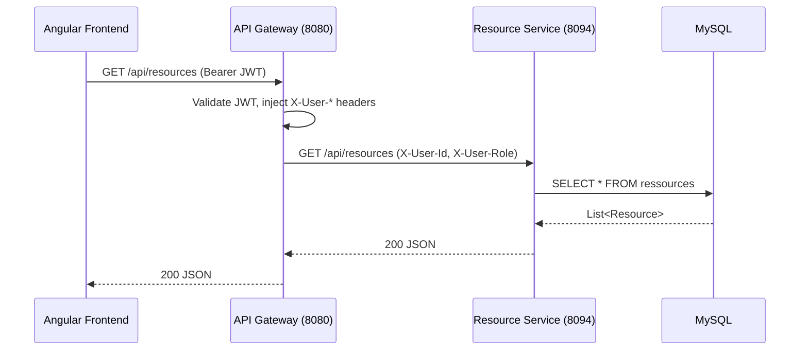

# Design Document — IUSJ Remaining Features

## Overview

Ce document décrit l'architecture et l'implémentation des 5 fonctionnalités restantes du projet IUSJ Planner. Toutes les décisions de design s'appuient sur les patterns existants dans le codebase (Spring Boot 3.3.4, Angular 18+, PrimeNG, Lombok, JPA).

---

## Architecture

Le projet suit une architecture microservices :

```
Angular Frontend (port 4200)
        ↓ HTTP
API Gateway (port 8080) — JWT validation + header injection (X-User-Id, X-User-Role, X-User-Name)
        ↓ Load Balanced via Eureka
Microservices Spring Boot (ports 8081–8093)
        ↓ JPA
MySQL (port 3306, base bd_tutore)
```

Chaque microservice suit le même pattern :
- `SecurityConfig` + `HeaderAuthenticationFilter` (auth via headers injectés par le gateway)
- Entité JPA + Repository + Service + Controller
- Enregistrement Eureka + routage Gateway

---

## Components and Interfaces

### Feature 1 — Page Admin Enseignants (Frontend uniquement)

Le backend `iusj-teacher-service` (port 8083) est déjà complet avec :
- `GET/POST /api/teachers`, `GET/PUT/DELETE /api/teachers/{id}`
- `GET /api/teachers/by-user/{userId}`
- `TeacherService` Angular déjà implémenté dans `web/src/app/core/services/teacher.service.ts`

**Composant à créer :** `web/src/app/pages/admin/enseignants.ts`

Pattern identique à `utilisateurs.ts` et `groupes.ts` :
- Tableau PrimeNG avec pagination et recherche
- Dialog de création/modification
- Résolution du nom via `userId` → `UserService.getAll()`
- Champ `specialities` : liste de tags (input text + ajout dynamique)

**Menu :** Ajouter dans `app.menu.ts` sous "Gestion" : `{ label: 'Enseignants', icon: 'pi pi-fw pi-graduation-cap', routerLink: ['/pages/admin/enseignants'] }`

**Route :** Ajouter dans `pages.routes.ts` : `{ path: 'admin/enseignants', component: EnseignantsPage, canActivate: [authGuard, roleGuard], data: { roles: ['ADMIN'] } }`

---

### Feature 2 — Resource Service Backend

**Port :** 8094 (après event-service sur 8093)

**Structure :**
```
iusj-resource-service/src/main/java/com/example/iusj_resource_service/
├── config/SecurityConfig.java          (copie du pattern event-service)
├── security/HeaderAuthenticationFilter.java
├── entities/Resource.java              (id, nom, type, quantite, localisation, statut)
├── repositories/ResourceRepository.java
├── services/ResourceService.java
├── controller/ResourceController.java
└── IusjResourceServiceApplication.java (existant)
```

**Entité Resource :**
```java
@Entity @Table(name = "ressources")
- id: Long (PK auto)
- nom: String (NotBlank, max 255)
- type: Enum (PROJECTEUR, ORDINATEUR, MATERIEL, AUTRE)
- quantite: Integer (Min 1)
- localisation: String (max 255)
- statut: Enum (DISPONIBLE, RESERVE, MAINTENANCE)
- createdAt: LocalDateTime (@PrePersist)
- updatedAt: LocalDateTime (@PreUpdate)
```

**Endpoints :**
- `GET /api/resources` — liste toutes les ressources
- `GET /api/resources/{id}` — détail
- `POST /api/resources` — créer
- `PUT /api/resources/{id}` — modifier
- `DELETE /api/resources/{id}` — supprimer
- `GET /api/resources/stats` — `{ total, disponible, reserve, maintenance }`

**application.properties :**
```properties
spring.application.name=iusj-resource-service
server.port=8094
# même pattern DB/Eureka que les autres services
```

**Gateway routing** (à ajouter dans `iusj-gateway-service/src/main/resources/application.yml`) :
```yaml
- id: resource-service
  uri: lb://iusj-resource-service
  predicates:
    - Path=/api/resources/**
```

---

### Feature 3 — Page Ressources Frontend

**Service Angular à créer :** `web/src/app/core/services/resource.service.ts`
- Endpoint : `ApiEndpoints.resources` (à ajouter dans `api-endpoints.ts`)
- Méthodes : `getAll()`, `getById(id)`, `create(payload)`, `update(id, payload)`, `delete(id)`

**Modèle Angular à créer :** `web/src/app/core/models/resource.model.ts`
```typescript
export interface Resource {
  id?: number;
  nom: string;
  type: 'PROJECTEUR' | 'ORDINATEUR' | 'MATERIEL' | 'AUTRE';
  quantite: number;
  localisation: string;
  statut?: 'DISPONIBLE' | 'RESERVE' | 'MAINTENANCE';
}
```

**Page à modifier :** `web/src/app/pages/admin/ressources.ts`
- Remplacer l'utilisation de `RoomService` par `ResourceService`
- Ajouter le dialog de création/modification avec les vrais champs
- Ajouter la confirmation de suppression

---

### Feature 4 — Report Service Backend

**Port :** 8095

**Structure :**
```
iusj-report-service/src/main/java/com/example/iusj_report_service/
├── config/SecurityConfig.java
├── security/HeaderAuthenticationFilter.java
├── entities/ReportMetadata.java        (id, type, format, generatedAt, filePath, status)
├── repositories/ReportMetadataRepository.java
├── services/
│   ├── ReportService.java              (orchestration)
│   ├── ReportDataCollector.java        (appels REST vers autres services)
│   ├── PdfReportGenerator.java         (OpenPDF — déjà dans pom.xml)
│   └── ExcelReportGenerator.java       (Apache POI — déjà dans pom.xml)
├── controller/ReportController.java
└── IusjReportServiceApplication.java   (existant)
```

**Entité ReportMetadata :**
```java
@Entity @Table(name = "report_metadata")
- id: String (UUID, PK)
- type: String (room-usage, teacher-activity, resources, resolved-conflicts)
- format: String (pdf, excel)
- generatedAt: LocalDateTime
- filePath: String
- status: Enum (PENDING, DONE, ERROR)
```

**ReportDataCollector** : appelle les autres services via `RestTemplate` (pattern identique à `ScheduleDataCollector` dans schedule-service) :
- `room-usage` → `GET http://iusj-room-service/api/rooms`
- `teacher-activity` → `GET http://iusj-teacher-service/api/teachers`

**Stockage fichiers :** dossier `reports-storage/` (déjà créé dans le projet)

**Endpoints :**
- `POST /api/reports/generate` — génère et retourne `ReportMetadata`
- `GET /api/reports` — liste les rapports générés
- `GET /api/reports/{id}/download` — télécharge le fichier

**Gateway routing :**
```yaml
- id: report-service
  uri: lb://iusj-report-service
  predicates:
    - Path=/api/reports/**
```

---

### Feature 5 — Dashboard Dynamique Frontend

**Composants à modifier :**

`AdminStatsWidget` — déjà partiellement dynamique, ajouter :
- Fetch `GET /api/groups` pour le nombre de groupes d'étudiants
- Fetch `GET /api/events` pour les événements à venir
- Corriger le mapping du statut actif des enseignants (le backend retourne `statut: 'ACTIVE'` pas `'actif'`)

`RecentActivitiesWidget` — remplacer les données statiques par :
- Fetch `GET /api/schedule` (limité aux 5 dernières entrées)
- Résolution des labels via les maps de référence (courses, teachers, groups)

---

## Data Models

### Resource (Backend)
| Champ | Type | Contraintes |
|-------|------|-------------|
| id | Long | PK, auto-généré |
| nom | String | NotBlank, max 255 |
| type | Enum | PROJECTEUR, ORDINATEUR, MATERIEL, AUTRE |
| quantite | Integer | Min 1 |
| localisation | String | max 255 |
| statut | Enum | DISPONIBLE, RESERVE, MAINTENANCE |
| createdAt | LocalDateTime | auto @PrePersist |
| updatedAt | LocalDateTime | auto @PreUpdate |

### ReportMetadata (Backend)
| Champ | Type | Contraintes |
|-------|------|-------------|
| id | String | UUID, PK |
| type | String | room-usage, teacher-activity, etc. |
| format | String | pdf, excel |
| generatedAt | LocalDateTime | auto |
| filePath | String | chemin absolu |
| status | Enum | PENDING, DONE, ERROR |

### Resource (Frontend)
```typescript
interface Resource {
  id?: number;
  nom: string;
  type: 'PROJECTEUR' | 'ORDINATEUR' | 'MATERIEL' | 'AUTRE';
  quantite: number;
  localisation: string;
  statut?: 'DISPONIBLE' | 'RESERVE' | 'MAINTENANCE';
}
```

---

## Error Handling

- **Backend** : pattern identique aux services existants — `@ExceptionHandler` pour `EntityNotFoundException` (404), `IllegalArgumentException` (400), `ResponseStatusException` (status variable)
- **Frontend** : pattern `catchError(() => of([]))` dans les forkJoin du dashboard pour éviter les crashs ; `MessageService` PrimeNG pour les toasts d'erreur dans les pages CRUD

---

## Testing Strategy

- Tests optionnels (marqués `*` dans le plan de tâches)
- Les services backend suivent le pattern des tests existants (JUnit 5 + Mockito)
- Pas de tests E2E requis pour cette implémentation

---

## Diagramme de flux — Resource Service


